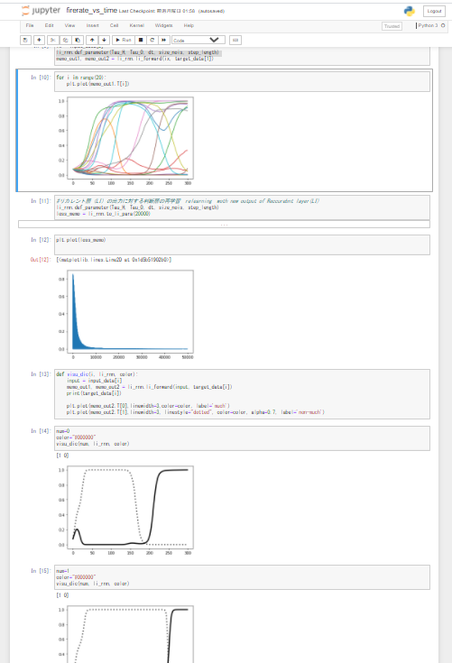

# li_rn_network
## Description
Simulator of working memory on the prefrontal cortex (PFC)

## Demo
There are three notebooks here.
- The fire rate vs time: firerate_vs_time/firerate_vs_time.ipynb
- 3 back task: firerate_vs_time/3-bask.ipynb
- PCA: PCA/PCA.ipynb

## Requirement
- python3
- jupyter
- Numpy
- matplotlib
- seaborn
- sklearn

No GPU needed.

## Author

[@picker_wtb](https://twitter.com/picker_wtb)

## License

[MIT](http://b4b4r07.mit-license.org)